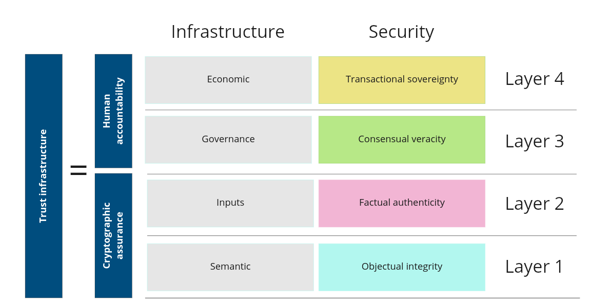

Hi there, wanderer!

No matter whether you visit this space just out of curiosity or looking for something specific, let us do a quick, yet intense introduction to what you can find here. We are a team of individuals that truly believe in a world, where data flows do not end up in a few data silos. We believe in the opposite, where individuals are in the centre of these flows and they are controlled by them. The decentralization is a next inevitable step towards individuals. To achieve that, we need to build proper tech that operates in a decentralized paradigm, without any central point of control. This is more complex, yet we have a vision for it. We also encourage you to [get acquainted](https://humancolossus.foundation/blog/dde-first-contact) a bit deeper into this topic.

Now, if you are still with us, let us guide you through the tech stack we believe is a key to achieve our beliefs mentioned above. 

<!--

**Here are some ideas to get you started:**

🙋‍♀️ A short introduction - what is your organization all about?
🌈 Contribution guidelines - how can the community get involved?
👩‍💻 Useful resources - where can the community find your docs? Is there anything else the community should know?
🍿 Fun facts - what does your team eat for breakfast?
🧙 Remember, you can do mighty things with the power of [Markdown](https://docs.github.com/github/writing-on-github/getting-started-with-writing-and-formatting-on-github/basic-writing-and-formatting-syntax)
-->
